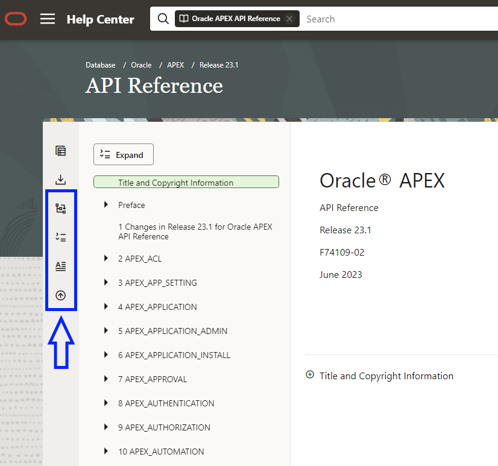

# Redwood Help Center Enhancer - Browser Extension

The Redwood Help Center Enhancer is a browser extension designed to improve the user experience of the new Redwood themed Oracle Help Center. This extension enhances the navigation options by adding useful features to the navigation center's button bar.

## Purpose

The Oracle Help Center provides comprehensive documentation on Oracle products, and in 2023, it introduced the Redwood theme to enhance the user interface. However, some users may find the navigation experience lacking certain functionalities. 

One such opinion was expressed via a blog Post here [Oracle-base:  Oracle Documentation - The Redwood Look & Feel](https://oracle-base.com/blog/2023/06/16/oracle-documentation-the-redwood-look-feel/)

The Redwood Help Center Enhancer aims to address these limitations by offering several navigational enhancements.

## Features

The Redwood Help Center Enhancer implements the following features through additional buttons in the navigation center's button bar:

1. **Fully Expand Navigation Menu**: This feature allows users to expand the navigation menu to the last level, providing a complete view of the available documentation sections.

2. **Close Auxillary Navigation Drawer**: To maximize the screen space for reading the documentation, this feature automatically closes the auxillary navigation drawer conveniently.

3. **Access Expand/Collapse Button Anywhere**: Users can access the expand/collapse button from anywhere on the page, making it easier to toggle the navigation menu.

4. **Fast Access to Document Title**: This feature provides users with quick access to the document title, allowing them to promptly move to the document title page.

5. **Fast Scroll to Top**: Users can instantly scroll to the top of the page efficiency.

## How to Use

To use the this browser extension, follow these steps:

1. Download and install the extension from the appropriate web browser store (Chrome Web Store, Firefox Add-ons, etc.).

2. Once installed, navigate to the Oracle Help Center.

3. In the navigation center's button bar, you will find the additional buttons added by the Redwood Help Center Enhancer.

4. Click on the buttons to utilize the respective features:
   - To fully expand the navigation menu, click the "Expand" button.
   - To reopen the auxillary navigation drawer, click the "Chevron" icon button.
   - To access the expand/collapse button from anywhere, click the "Expand/Collapse" button.
   - To quickly view the document title, click the "Document Title" button.
   - To fast scroll to the top of the page, click the "Scroll to Top" button.

## Feedback and Issues

If you encounter any problems while using this browser entension or have suggestions for additional features, please feel free to submit issues or provide feedback on the GitHub repository.

## Social Media
Click to [follow me](https://www.x.com/Matt_Mulvaney) on X 

## Resources

- Oracle Help Center: [https://www.oracle.com/help/](https://www.oracle.com/help/)
- Blog Post on Oracle-base: [Oracle Documentation - The Redwood Look & Feel](https://oracle-base.com/blog/2023/06/16/oracle-documentation-the-redwood-look-feel/)

I hope you find the Redwood Help Center Enhancer useful in enhancing your navigation experience on the Oracle Help Center! Happy browsing!
